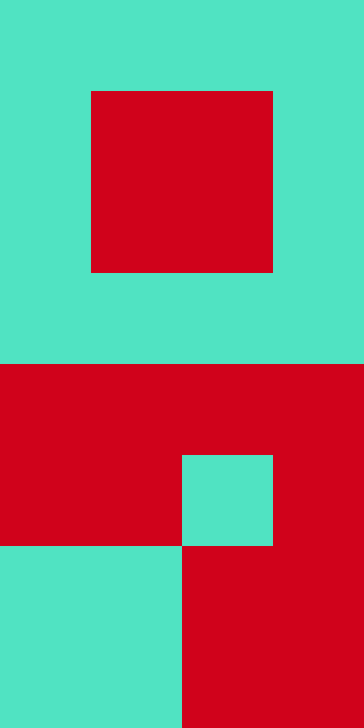

# [Exercises] ConstraintLayouts


### Consignes :

• Chaque couleur représente une vue, la couleur de fond est le blanc.

• La vue doit pouvoir être la même sur tous les appareils ! (téléphones 5", téléphones 6", tablettes 7", tablettes 10", etc ..)

• Designer ces vues en utilisant qu'un seul ConstraintLayout et des Views à l'intérieur.

• Tous les attributs layoutwidth et layoutheight des Views doivent être à 0dp (voir exemple)

### Example :


### Answer :

```
<android.support.constraint.ConstraintLayout xmlns:android="http://schemas.android.com/apk/res/android"
    xmlns:app="http://schemas.android.com/apk/res-auto"
    android:layout_width="match_parent"
    android:layout_height="match_parent">

    <View
        android:id="@+id/view_back"
        android:background="@color/green"
        app:layout_constraintStart_toStartOf="parent"
        app:layout_constraintTop_toTopOf="parent"
        app:layout_constraintEnd_toEndOf="parent"
        app:layout_constraintBottom_toBottomOf="parent"
        android:layout_width="0dp"
        android:layout_height="0dp" />

    <View
        android:id="@+id/view_front"
        android:background="@color/red"
        app:layout_constraintStart_toStartOf="@+id/view_back"
        app:layout_constraintTop_toTopOf="@+id/view_back"
        app:layout_constraintEnd_toEndOf="@+id/view_back"
        app:layout_constraintBottom_toBottomOf="@+id/view_back"
        android:layout_width="0dp"
        app:layout_constraintHeight_percent="0.5"
        android:layout_height="0dp" />

</android.support.constraint.ConstraintLayout>
```

### #1


```
<android.support.constraint.ConstraintLayout xmlns:android="http://schemas.android.com/apk/res/android"
    xmlns:app="http://schemas.android.com/apk/res-auto"
    android:layout_width="match_parent"
    android:layout_height="match_parent">

    

</android.support.constraint.ConstraintLayout>
```

### #2


```
<android.support.constraint.ConstraintLayout xmlns:android="http://schemas.android.com/apk/res/android"
    xmlns:app="http://schemas.android.com/apk/res-auto"
    android:layout_width="match_parent"
    android:layout_height="match_parent">

    

</android.support.constraint.ConstraintLayout>
```

### #3


```
<android.support.constraint.ConstraintLayout xmlns:android="http://schemas.android.com/apk/res/android"
    xmlns:app="http://schemas.android.com/apk/res-auto"
    android:layout_width="match_parent"
    android:layout_height="match_parent">

    

</android.support.constraint.ConstraintLayout>
```

### #4


```
<android.support.constraint.ConstraintLayout xmlns:android="http://schemas.android.com/apk/res/android"
    xmlns:app="http://schemas.android.com/apk/res-auto"
    android:layout_width="match_parent"
    android:layout_height="match_parent">

    

</android.support.constraint.ConstraintLayout>
```

### #5


```
<android.support.constraint.ConstraintLayout xmlns:android="http://schemas.android.com/apk/res/android"
    xmlns:app="http://schemas.android.com/apk/res-auto"
    android:layout_width="match_parent"
    android:layout_height="match_parent">

    

</android.support.constraint.ConstraintLayout>
```
