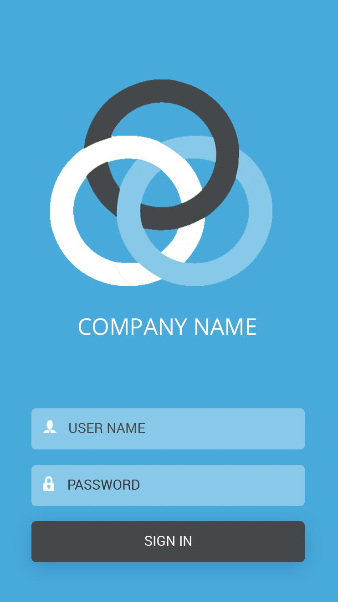
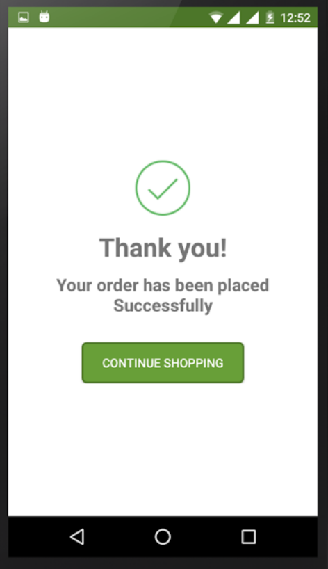
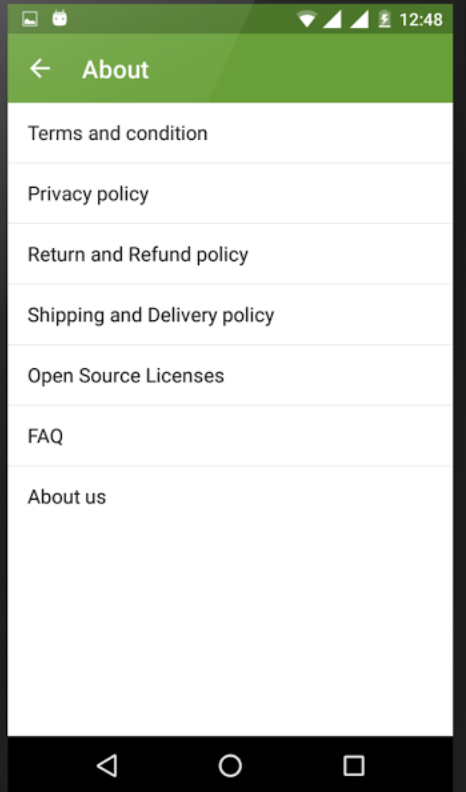
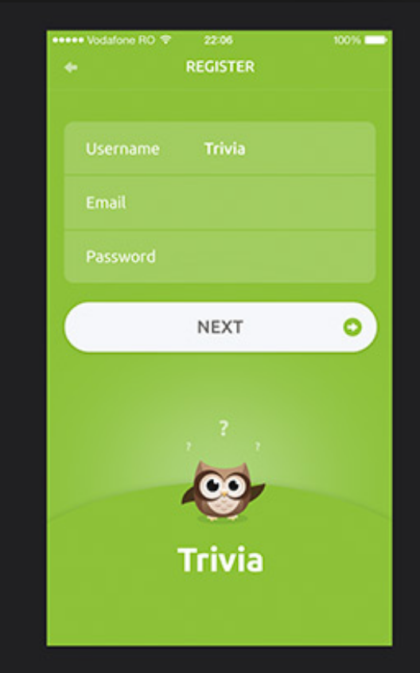
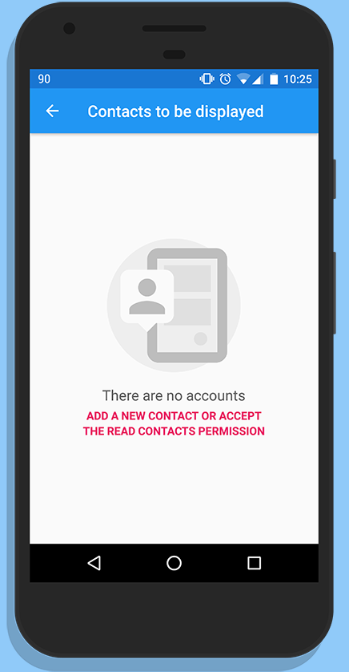

# [Exercises] Layouts


### Example :



### Answer :

```
* ConstraintLayout
	* ImageView
	* LinearLayout
		* Edittext
		* Edittext
		* Button
```

## Find the right layouts in these applications :

### #1


```
* 
```

### #2


```
* 
```

### #3


```
* 
```

### #4


```
* 
```

### #5


```
* 
```

### #6


```
* 
```

### #7


```
* 
```

### #8


```
* 
```

### #9


```
* 
```

### #10


```
* 
```

### #11


```
* 
```

### #12


```
* 
```

### #13


```
* 
```


